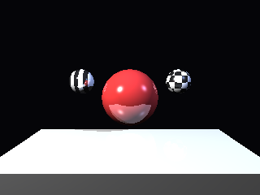

# Whitted Raytracer (x86_64 Assembly)

A minimal Whitted-style raytracer written in x86_64 NASM for Linux. It reads a
scene description from **stdin** and writes an 8-bit RGB PNG image to
**stdout** using libpng's simplified API.



The image above (`out.png`) is generated from `scenes/sample.scene`.

## Features

- Spheres and axis-aligned cubes
- Point lights with diffuse + specular shading
- Procedural textures (solid, checker, stripe)
- Recursive reflections (Whitted-style)
- PNG output to stdout

## Requirements

- Linux x86_64
- `nasm`
- `gcc`
- `libpng` and `zlib` (plus `pkg-config` if available)

## Build

```sh
make
```

## Run

```sh
./raytrace < scenes/sample.scene > out.png
```

## Scene format

Whitespace-separated tokens (comments start with `#`). All values are numeric
except the texture type.

```
image <width> <height>
camera <px> <py> <pz> <lx> <ly> <lz> <upx> <upy> <upz> <fov_deg>
ambient <r> <g> <b>
background <r> <g> <b>
maxdepth <n>
exposure <value>

material <id>
  <diff_r> <diff_g> <diff_b>
  <spec_r> <spec_g> <spec_b>
  <shininess>
  <reflect>
  <texture_type>
  [texture params...]

sphere <cx> <cy> <cz> <radius> <material_id>
cube <minx> <miny> <minz> <maxx> <maxy> <maxz> <material_id>
light <px> <py> <pz> <r> <g> <b> <intensity>
```

Texture params:

- `solid` — no extra params (uses diffuse color)
- `checker <scale> <r1> <g1> <b1> <r2> <g2> <b2>`
- `stripe  <scale> <r1> <g1> <b1> <r2> <g2> <b2>`

Tonemapping:

- `exposure` controls a Reinhard tone mapper: color = (color * exposure) / (1 + color * exposure).

## Project layout

- `src/asm` — NASM source files
- `scenes` — sample scene files
- `raytrace` — build output binary

## Notes

- Output is always 8-bit RGB PNG.
- The renderer expects reasonable numeric input (no extensive validation).

## Clean

```sh
make clean
```
